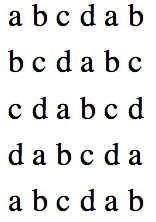

# Checkerboard

## Original Lab: http://web.eecs.utk.edu/~bvz/cs140/Labs/Lab1/

A generalized checkerboard is a rectangular grid, one that has four parameters:

    R:  The number of rows.
    C:  The number of columns.
    SC: The starting character.
    CS: The cycle size.

The grid is a (R * C) matrix, where the element in row r and column c, contains the character SC + (r+c)%CS. For example, here's a generalized checkerboard with R=5, C=6, SC = 'a' and CS=4:

Your job is to write the program checkerboard.cpp, which reads five inputs from standard input. The first four are the parameters R, C, SC and CS, as defined above. The fifth parameter is a width W. The starting character, SC, should be read as a char and the remaining parameters should be read as integers.

Your program should print out the specified checkerboard such that each element of the grid is printed as a (W * W) square. Here are a few examples:

**Error checking**: Your program should print the same output as mine on standard error if too few arguments are given, or if they are not numbers. It should exit silently if any of the parameters is less than or equal to zero, and if the ASCII value of the starting character plus the cycle size is greater than 127.